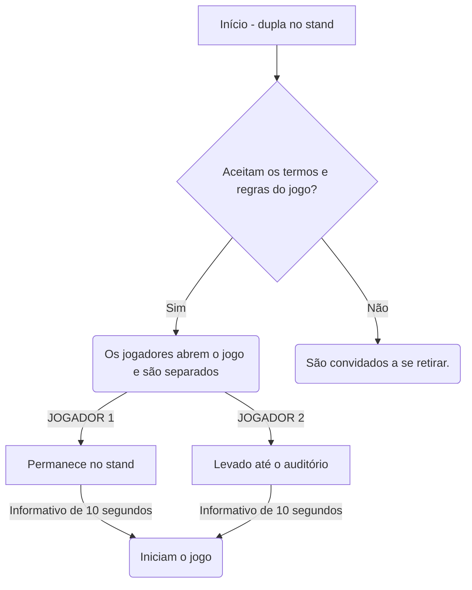
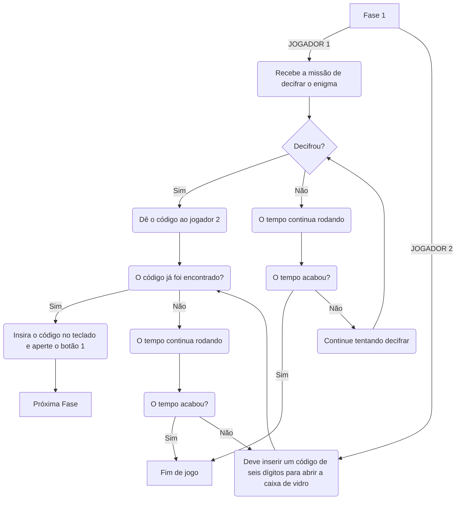
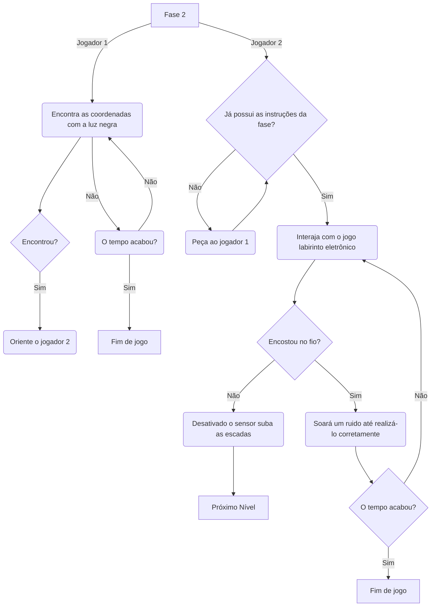
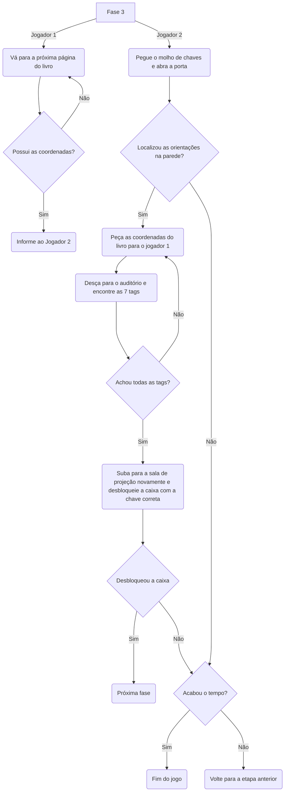
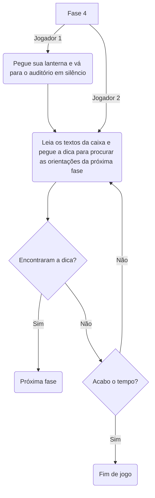

# O mistério da meia noite

### **PREMISSA:**
A cerca de 20 anos atrás, um órfão chegou na porta do câmpus pedindo abrigo, e caridosamente os docentes o abrigaram na sala de projeção acima do auditório em troca de que realizasse alguns trabalhos simples, como por exemplo auxiliar o zelador e trancar o campûs após a última pessoa ir embora pela noite.

Ao longo do tempo o garoto começou a relatar um desconforto em trabalhar ao lado do zelador, e dizer que tinha muito medo de ficar sozinho de noite no câmpus, mas por ser uma criança que passou por muitas situações traumáticas, as pessoas apenas ignoravam e diziam para ele ir dormir mais cedo e não inventar problemas.

Certo dia o garoto desapareceu, o zelador seria a única pessoa capaz de saber de algo pois eles passavam muito tempo juntos, mas disse que não fazia ideia do que tinha acontecido. 

A história ficou ainda mais estranha quando um professor contou que na noite anterior ao sumiço, estava passando aos arredores do campus perto da meia noite e escutou gritos horripilantes, TÃO tenebrosos que estimulou sua imaginação a pensar que alguém estivesse em apuros…Mas logo em seguida se convenceu que os sons eram apenas frutos da sua imaginação fértil, ignorou a situação e seguiu seu caminho.

Ao subirem para averiguar o quarto do menino, não haviam rastros de corpo algum, mas algumas velas suspeitas, uma caixa misteriosa ao lado da cama, e os pertences do órfão pelo local. A situação continua sem uma solução, porém alguns corajosos estão dispostos a ir em busca de respostas. Prontos para enfrentar este mistério?


### **JOGO IDEAL:**

**Início:**
As duas pessoas interessadas deverão ir até o stand, onde irão ler a premissa da história, assinar um termo de comprometimento e abrir a interface nos seus celulares através de um QR code.

O jogador 1 entra em uma parte fechada do stand e é orientado a por o fone de ouvido que estará a disposição, enquanto o jogador 2 é direcionado ao auditório. A interface ficará na tela de carregamento até que os dois jogadores estejam corretamente nos seus locais indicados.

Após esta etapa, a interface irá apresentar o seguinte informativo por 10 segundos: "Agora são 23:50 do dia 23 de junho. O ritual dos espíritos inicia à meia noite e vocês precisam terminar todos os níveis dentro do tempo indicado para conseguirem sair a salvo. Boa sorte…”. Após o informativo, se inicia o primeiro nível.

IMPORTANTE: os jogadores tem até 10 minutos para completar todas as fases do jogo, terá um cronômetro no canto superior da tela indicando o tempo.




**Nível 1:**

Jogador 1 (stand): aparece na tela que este jogador precisa encontrar um código, e para isso ele terá que usar a carta que vai estar em cima da mesa. Esta carta será um texto do garoto relatando alguns fatos.

Jogador 2 (auditório): é informado que precisa aguardar o código e inseri-lo corretamente para abrir a porta de vidro e pegar o molho de chaves.
Após conseguirem decifrar o código e o jogador 2 pegar as chaves, avançam para o próximo nível.



**Nível 2:**

Jogador 1(stand): aparece na sua tela que precisa encontrar as instruções desta fase no stand. Em cima da mesa, terá uma luminária de luz negra. As instruções estarão escritas de forma que só sejam vistas com a luz negra. A orientação vai sera coordenadas que deverão ser informadas ao outro jogador. Quando o outro jogador seguir todas as coordenadas corretamente, este jogador deve juntar-se ao outro no auditório, para subirem na sala de projeção e conseguirem encontrar a tag que abre a caixa ao lado da cama.

Jogador 2(auditório):  este jogador precisa seguir as coordenadas e encontrar 7 tags pelo auditório, assim que ele localizar todas as tags o jogador 2 deve se juntar a ele no auditório para subirem até a sala de projeção. Chegando lá em cima terá uma caixa ao lado da cama que desbloqueia apenas com uma das tags, eles deverão encontrar qual é a correta para passar para o próximo nível. 



**Nível 3:**

Jogador 1(stand):  este jogador é indicado a ir até uma página específica do livro, e nesta página tem 7 coordenadas diferentes (indicando fileira e número de cadeira)

Jogador 2(auditório): ele encontra no molho de chaves a chave que abre a porta da sala de projeção, sobe as escadas e a interface pede para que o jogador procure pistas do que fazer pelas paredes da sala. Nas paredes terá as orientações para ele voltar para a parte de baixo do auditório e pegar os itens de acordo com as coordenadas do outro jogador. Ele irá encontrar 7 tags iguais e precisa subir com elas para a sala de projeção novamente. Na mesa de cabeceira há uma caixa trancada, e ele é orientado a encontrar qual das 7 tags abre a caixa (após encontrar, precisa guardar as outras 6 pois serão úteis para os próximos níveis). Quando o jogador aproximar da caixa a tag correta, eles passam para o próximo nível.


**Nível 4:**

Jogador 1: na sua tela, aparece “O outro jogador está correndo perigo, pegue sua lanterna e se direcione de forma silenciosa até o auditório para encontrá-lo na sala de projeção subindo as escadas da porta á esquerda”.

Jogador 2: abrindo a caixa que foi desbloqueada, se depara com imagens e textos de páginas antigas (aspecto amarelado e um pouco rasgado) que informam que aquele era um lugar de rituais muito antes do garoto ir morar lá, que os espíritos raptaram sua alma e de algumas outras pessoas que se atrevem a entrar no local no momento da cerimônia. Diz que existe apenas um jeito de impedir que o ritual aconteça, e dá dicas de onde os jogadores têm que encontrar essas orientações. Os jogadores verão pistas pela sala, que vão direcioná-los a olharem para fora das janelas que tem na sala de projeção. Haverá um sensor nas janelas, assim que eles olharem verão as instruções em cima do ar condicionado, e a interface iniciará o próximo e último nível do jogo.


**Nível 5:**

Os jogadores vão ser orientados a usarem as tags que foram coletadas anteriormente, pois cada uma desativa uma vela apenas aproximando. O ambiente deve iniciar uma música de aflição, mensagens pedindo para os jogadores serem rápidos. Caso consigam completar esse e os outros níveis dentro do tempo de 10 minutos, saem com a vitória. Aparece na tela  “Final vitorioso". Vocês acabam de destruir o ritual, agora a alma do pequeno órfão e de outras pessoas está livre. Se reúnam no stand e comemorem a vitória juntos”.
No stand deve haver uma placa com o ranking de vencedores mais rápidos, e a numeração de pessoas que não conseguiram completar o jogo.


### **Hardware que será utilizado:**

Início: sensor de presença no auditório

Fase 1: Porta com sensor que a faz abrir caso a combinação (código) inserido esteja correto. 8 Displays para a sequência de código e 9 botões para inserir os números e confirmar (8 pra ir mudando os  números e 1 para OK).

Fase 2: Labirinto circuito eletrônico com timer para realizá-lo, caso contrário soa os barulhos e ele perde.

Fase 3: Sensor na caixa e chave deste sensor (o que a faz abrir). E outros 6 sensores para as velas (tags).

Fase 4: Sensor de movimento na janela para iniciar a próxima fase

Fase 5: Tags da fase 5 encaixando em outros sensores para desligar o led de cada vela

**Resumo dos itens físicos:**

- Termos de compromisso impressos
- Placas de vencedores e perdedores
- Fone de ouvido para o stand
- Duas lanternas de dínamo
- Caixa e porta de vidro - displays, sensores, motor, etc (fase 1)
- Componentes para o circuito - sensor da escada, buzzer, fios, etc (fase 2)
- Giz para escrita nas paredes e desenho da estrela de 6 pontas no chão
- Imagens para as paredes
- 7 tags (fase 3)
- Caixa com trava magnética que abre com uma tag (fase 4)
- Páginas amareladas falando sobre a história dos espíritos e explicando o ritual (fase 4)
- Sensor para a janela da sala de projeção (fase 5)
- Cartolina estilizada com as orientações para desativar o ritual (fase 5)
- Velas com sensor das tags (fase 5)
- Cama feita com caixas, coberta e almofadas
- Mesinha de cabeceira
- Diário (stand - fase 1 e 2)
- Luz negra (fase 2)
- Calendário com o dia 23 de junho circulado (fase 1)
- Faixa amarela e preta


### **OBJETIVO DO JOGO:**
Os jogadores tem o objetivo final de destruir o ritual antes da meia noite, para que não sejam capturados pelos espíritos e conseguirem salvar as almas que já estão presas local, mas até conseguir isso, terão que enfrentar uma sequência de níveis que exige raciocínio lógico e agilidade. Caso não consigam cumprir o tempo estimado para qualquer etapa, o jogo estará perdido e os jogadores devem se retirar. Informações que podem ser importantes para o jogo:
- Os jogadores devem estar atentos aos objetos ao seu redor, em um escape room qualquer objeto pode ser uma dica.

### **REGRAS:**
- Antes de começar, deverão assinar um termo de compromisso indicando que estão cientes que o jogo não é ligado a nenhum tipo de religião e trata-se de apenas um cenário falso.
- O jogo só pode ser jogado por duas pessoas ao mesmo tempo.
- Os jogadores vão se comunicar por áudio através da interface.
- As fases deverão ser executadas dentro do tempo indicado, na ordem indicada.
- Para desistir do jogo, deverá ser apertado um botão que ficará no canto da tela com o símbolo de perigo, e confirmar. Quando confirmarem a interface fecha e eles são liberados.
- Não podem sair do local que o jogo estará indicando durante a execução.
- O jogo deve ser terminado em no máximo 10 minutos. Terá um cronômetro no canto da tela sinalizando o tempo.
- Na lateral da interface terá um símbolo (triângulo amarelo de alerta) para que os jogadores desistam do jogo. Se este botão for acionado por qualquer um dos dois jogadores, uma sirene toca e o jogo se encerra.
- Os componentes eletrônicos presentes no escape room são sensíveis, é importante que os jogadores joguem com cuidado.
- Os jogadores devem tomar cuidado com as escadas do local.

### **REFERÊNCIAS:**
- [Filme Escape Room;](https://www.youtube.com/watch?v=v9JFZFQLt9k)
- [Filme Um classico filme de terror](https://www.youtube.com/watch?v=hYuV9N5egg8)
- [Série Stranger Things](https://www.netflix.com/br/title/80057281)
- [Jogo Pacify](https://store.steampowered.com/app/967050/Pacify/)


### **COMO GERAR RECEITA:**
- Venda de ingressos para entrada no Escape Room;
- Parceria com eventos/lugares para replicar o Escape Room em outros ambientes, aumentando o alcance.

### **MODELO DE NEGÓCIO: CANVAS:**

**Parceiros Chave**
```python
    - AWS (nuvem Amazon)
    - Arduino
    - Cineplay São José
    - MicroPython
    - Espressif
    - Continente Park Shopping
```

**Atividades Chave**
```python
    - Aprimoramento dos conhecimentos de JavaScript, HTML e CSS.
    - Estudo em desenvolvimento de jogos.
    - Aprimoramentos em estratégia de marketing.
    - Desenvolvimento manual do designer da interface em estilo de pixels.
    - Criação de redes sociais, posts de divulgação e mensagens para os potenciais usuários.
    - Estudo em tecnologia IoT e hardware.
    - Estudo de designer de interface virtual.
```

**Recurso Chave**
```python
    - Aplicação da lógica de programação.
    - Aplicação de hardware nos locais específicos do Escape Room.
    - Conta no GitPod para desenvolvimento do jogo online.
    - Diretório no GitHub para administração de tarefas.
    - Sites online de desenvolvimento de imagens em pixel.
 ```
    
**Proposta de Valor**
```python
    - Jogo desenvolve habilidades de cooperatividade, estratégia e raciocínio lógico.
    - Ao consumir o produto, o cliente apoia o trabalho de estudantes da rede federal
    - Desafia os jogadores a enfrentarem o próprio medo.
    - Experiência imersiva em local estilizado de acordo com o tema proposto.
```

**Relação com o cliente**
```python
    - E-mail do SAC - aparece no final do jogo e no folder físico - disponível (para elogios, relatos de bug, críticas, etc).
    - Divulgação por redes sociais.
    - Avaliação no stand ao final do jogo.
```

**Canais**
```python
    - Folders físico (distribuir pelo IFSC, para familiares e amigos).
    - Instagram
    - E-mail
```

**Segmentos de Mercado**
   ```python
    - Pessoas com acesso a Internet e a algum dispositivo móvel.
    - Gostam de enigmas, aventura e terror.
    - Pessoas que residem a grande Florianópolis.
    - A partir de 14 anos.
    - Dupla de colegas interessados no jogo.

   ```
**Estrutura de Custos**
```python
    - Salário de dois funcionários (designer e programador).
    - Uber corporativo
    - Assinatura de ferramentas online.
    - Cursos profissionalizantes.
    - Contador (controle da receita do CNPJ)
    - Compra de cenário e componentes eletrônicos.
    - Tráfego pago no Instagram.
    - Manutenção de componentes eletrônicos.
    - Pagamento de serviços de profissionais externos (ex: dublador de áudio).
```

**Fontes de Renda**
```python
    - Venda de ingressos.
    - Replicar o evento em outros locais, promovendo a empresa e criando parcerias.
```