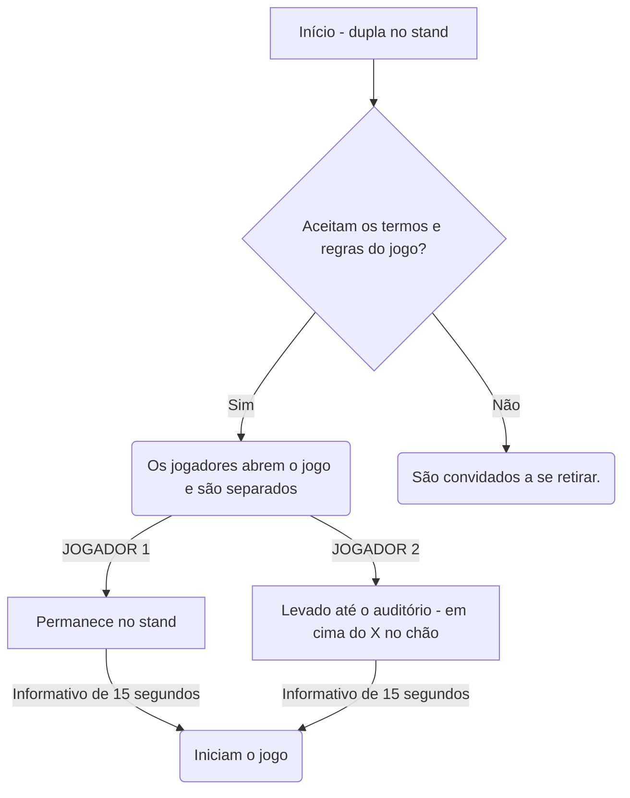

# O mistério da meia noite

### **PREMISSA:**
A cerca de 20 anos atrás, um órfão chegou na porta do câmpus pedindo abrigo, e caridosamente os docentes o abrigaram na sala de projeção acima do auditório em troca de que realizasse alguns trabalhos simples, como por exemplo auxiliar o zelador e trancar o campûs após a última pessoa ir embora pela noite.

Ao longo do tempo o garoto começou a relatar que coisas estranhas aconteciam após a meia noite no câmpus, mas por ser uma criança que passou por muitas situações traumáticas, as pessoas apenas ignoravam e diziam para ele tentar dormir mais cedo.

Esta história ficou ainda mais curiosa quando um  professor antigo contou que perto da meia noite, qualquer pessoa que passava aos arredores do campus conseguia escutar barulhos tenebrosos… TÃO tenebrosos, que estimulava a imaginação das pessoas para imaginarem que fossem gritos de almas presas sendo torturadas por outros espíritos.

Certo dia, o menino não desceu mais do seu quarto para nenhuma de suas tarefas diárias, e o seu principal companheiro (o zelador), decidiu subir para averiguar a situação. Não havia ninguém no local, apenas um símbolo e algumas velas suspeitas pelo chão, além dos pertences do garoto.

Após a situação tenebrosa, poucas pessoas tiveram coragem de subir na sala de projeção, e o órfão nunca mais apareceu. Os gritos da meia noite ainda podem ser ouvidos mas a situação continua sem uma solução. Prontos para enfrentar o mistério?

### **JOGO IDEAL:**

**Início:**
As duas pessoas interessadas deverão ir até o stand, onde irão ler a premissa da história, assinar um termo de comprometimento e abrir a interface nos seus celulares através de um QR code.

O jogador 1 entra em uma parte fechada do stand e é orientado a por o fone de ouvido que estará a disposição, enquanto o jogador 2 ganha uma lanterna de dínamo e é direcionado ao auditório. A interface ficará na tela de carregamento até que os dois jogadores estejam corretamente nos seus locais indicados.

Após esta etapa, a interface irá apresentar o seguinte informativo por 10 segundos: "Agora são 23:50 do dia 23 de junho. O ritual dos espíritos inicia à meia noite e vocês precisam terminar todos os níveis dentro do tempo indicado para conseguirem sair a salvo. Boa sorte…”. Após o informativo, se inicia o primeiro nível.



**Nível 1:**

Jogador 1 (stand): aparece na tela que este jogador precisa encontrar um código, e para isso ele terá que usar o calendário e o diário que estão dispostos na mesa.

Jogador 2 (auditório): é informado que precisa aguardar o código e inseri-lo corretamente para abrir a porta de vidro e pegar a chave.
Após conseguirem decifrar o código e o jogador 2 pegar a chave, avançam para o próximo nível.

```mermaid
   H[Fase 1] -->|JOGADOR 1| I(Recebe a missão de decifrar o enigma)
   I --> K{Decifrou?}
   K -->|Sim| L(Dê o código ao jogador 2)
   K -->|Não| M(O tempo continua rodando)
   M --> Q(O tempo acabou?)
   Q --> |Sim| R[Fim de jogo]
   Q --> |Não| S(Continue tentando decifrar)
   S --> K


   L --> N


   H -->|JOGADOR 2| J(Deve inserir um código de seis dígitos para abrir a caixa de vidro)
   J --> N(O código já foi encontrado?)
   N -->|Sim| O(Insira o código no teclado e aperte o botão 1)
   N --> |Não| P(O tempo continua rodando)
   P --> T(O tempo acabou?)
   T --> |Sim| R
   T --> |Não| J
   O --> X[Próxima Fase]
```

**Nível 2:**

Jogador 1(stand): aparece na sua tela que precisa encontrar as instruções desta fase numa página secreta do livro. Também em cima da mesa, terá uma luminária de luz negra. As instruções estarão escritas de forma que só sejam vistas com a luz negra no papel. A orientação do papel vai ser que é necessário realizar o circuito eletrônico sem encostar no fio para desativar o sensor da escada, evitando que o alarme soe e os espíritos acordem.

Jogador 2(auditório):  este jogador precisa realizar o circuito, e assim que finaliza-lo a interface inicia o próximo nível.

**Nível 3:**

Jogador 1(stand):  este jogador é indicado a ir até uma página específica do livro, e nesta página tem 7 coordenadas diferentes (indicando fileira e número de cadeira)

Jogador 2(auditório): ele encontra a chave que abre a porta da sala de projeção, sobe as escadas e a interface pede para que o jogador procure pistas do que fazer pelas paredes da sala. Nas paredes terá as orientações para ele voltar para a parte de baixo do auditório e pegar os itens de acordo com as coordenadas do outro jogador. Ele irá encontrar 7 tags iguais e precisa subir com elas para a sala de projeção novamente. Na mesa de cabeceira há uma caixa trancada, e ele é orientado a encontrar qual das 7 tags abre a caixa (após encontrar, precisa guardar as outras 6 pois serão úteis para os próximos níveis. Quando o jogador aproximar da caixa a tag correta, eles passam para o próximo nível.

**Nível 4:**

Jogador 1: na sua tela, aparece “O outro jogador está correndo perigo, pegue sua lanterna e se direcione de forma silenciosa até o auditório para encontrá-lo na sala de projeção subindo as escadas da porta á esquerda”.

Jogador 2: abrindo a caixa que foi desbloqueada, se depara com imagens e textos de páginas antigas (aspecto amarelado e um pouco rasgado) que informam que aquele era um lugar de rituais muito antes do garoto ir morar lá, que os espíritos raptaram sua alma e de algumas outras pessoas que se atrevem a entrar no local no momento da cerimônia. Diz que existe apenas um jeito de impedir que o ritual aconteça, e dá dicas de onde os jogadores têm que encontrar essas orientações. Os jogadores verão pistas pela sala, que vão direcioná-los a olharem para fora das janelas que tem na sala de projeção. Haverá um sensor nas janelas, assim que eles olharem verão as instruções em cima do ar condicionado, e a interface iniciará o próximo e último nível do jogo.

**Nível 5:**

Os jogadores vão ser orientados a usarem as tags que foram coletadas anteriormente, pois cada uma desativa uma vela apenas aproximando. O ambiente deve iniciar uma música de aflição, mensagens pedindo para os jogadores serem rápidos. Caso consigam completar esse e os outros níveis dentro do tempo de 10 minutos, saem com a vitória. Aparece na tela  “Final vitorioso". Vocês acabam de destruir o ritual, agora a alma do pequeno órfão e de outras pessoas está livre. Se reúnam no stand e comemorem a vitória juntos”.
No stand deve haver uma placa com o ranking de vencedores mais rápidos, e a numeração de pessoas que não conseguiram completar o jogo.


### **OBJETIVO DO JOGO:**
Os jogadores tem o objetivo final de destruir o ritual antes da meia noite, para que não sejam capturados pelos espíritos e conseguirem salvar as almas que já estão presas local, mas até conseguir isso, terão que enfrentar uma sequência de níveis que exige raciocínio lógico e agilidade. Caso não consigam cumprir o tempo estimado para qualquer etapa, o jogo estará perdido e os jogadores devem se retirar. Informações que podem ser importantes para o jogo:
- Os jogadores devem estar atentos aos objetos ao seu redor, em um escape room qualquer objeto pode ser uma dica.

### **REGRAS:**
- Antes de começar, deverão assinar um termo de compromisso indicando que estão cientes que o jogo não é ligado a nenhum tipo de religião e trata-se de apenas um cenário falso.
- O jogo só pode ser jogado por duas pessoas ao mesmo tempo.
- Os jogadores vão se comunicar por áudio através da interface.
- As fases deverão ser executadas dentro do tempo indicado, na ordem indicada.
- Para desistir do jogo, deverá ser apertado um botão que ficará no canto da tela com o símbolo de perigo, e confirmar. Quando confirmarem a interface fecha e eles são liberados.
- Não podem sair do local que o jogo estará indicando durante a execução.
- A interface começa a contar 40s após identificar que os dois jogadores estão na posição geográfica correta, que estará indicada no chão com um X no chão. No fim dos 40s o relógio começa a contar o tempo e o cronômetro também.
- Na lateral da interface terá um símbolo (triângulo amarelo de alerta) para que os jogadores desistam do jogo. Se este botão for acionado por qualquer um dos dois jogadores, uma sirene toca e o jogo se encerra.
- Os componentes eletrônicos presentes no escape room são sensíveis, é importante que os jogadores joguem com cuidado.
- Os jogadores devem tomar cuidado com as escadas do local.

### **REFERÊNCIAS:**
- [Filme Escape Room;](https://www.youtube.com/watch?v=v9JFZFQLt9k)
- [Filme Um classico filme de terror](https://www.youtube.com/watch?v=hYuV9N5egg8)
- [Série Stranger Things](https://www.netflix.com/br/title/80057281)
- [Jogo Pacify](https://store.steampowered.com/app/967050/Pacify/)

### **FLUXOGRAMA:**

Início do jogo


### **Descrição das cenas do jogo (interface):**

    1- Cena com a logo da empresa.
    
    2- Cena com nome do jogo.

    3- Cena de carregamento.
    Descrição: Faca pingando e mensagem “Aguardando todos os jogadores se posicionarem corretamente).
    OBS: colocar sensor de geolocalização (latitude e longitude) e ir para a próxima cena apenas quando os jogadores estiverem no local indicado.

    4- Cena com mensagem.
    Tempo de duração: 15 segundos.
    Item: canto inferior direito relógio marcando 23:50:00.
    Mensagem no meio da tela: "Agora são 23:50. O ritual dos espíritos inicia à meia noite e vocês precisam terminar todos os níveis dentro do tempo indicado para conseguirem sair a salvo. Boa sorte..."

    (após os 15 segundos, pular para próxima cena)

    5- Cena Nível 1.
    Item: canto inferior direito relógio passando o tempo (a partir de 23:50:00).
    Mensagem no meio da tela: “Nível 1 - Vocês precisam subir na sala de projeção, mas a porta está trancada. Dentro da caixa há uma chave, e o enigma para abri-la é uma data".

    OBS: ir para a próxima cena e abrir a porta de vidro quando o código for inserido no teclado da caixa corretamente.

    6- Cena Nível 2.
    Item: canto inferior direito relógio passando o tempo (continuando da outra cena).
    Mensagem no meio da tela: “Nível 2 - como resolver o mistério sem ir até a cena do crime? Pegue a chave e abra a porta à esquerda no fundo do auditório. Suba as escadas e aperte o botão em cima da cadeira para iniciar o próximo nível"

    7- Cena Nível 3.
    Item: canto inferior direito relógio passando o tempo (continuando da outra cena).
    Mensagem no meio da tela: "Nível 3: o relógio é um item importante para a jornada de vocês, mas para desbloquea-lo é necessário completar o circuito em cima da mesa passando o objeto de metal sem encostar no fio."

    8- Cena Nível 4.
    Item: canto inferior direito relógio passando o tempo (continuando da outra cena).
    Mensagem no meio da tela: "Nível 4: o tempo está quase acabando, precisamos atrasar o relógio para seguir com a última etapa da missão."

    OBS: ir para a próxima cena e voltar o relógio (físico) para 23:58:30 apenas quando a missão for executada.

    9- Cena Nível 5.
    Item: canto inferior direito relógio passando o tempo (volta para 23:58:30).
    Mensagem no meio da tela: "Nível 5: os espíritos já estão rodando por aí, é preciso destruir o ritual para saírem vivos. Cada vela tem um símbolo e são sensíveis, aproxime a mão em cima de cada uma na ordem correta indicada na página 7 do livro para destruir o ritual. CUIDADO: não encoste para não se queimar."

    10- Final.
    Mensagem no meio da tela: “Final vitorioso. Vocês acabam de destruir o ritual, agora a alma do pequeno órfão e de outras pessoas está livre. Se reúnam no stand e comemorem a vitória juntos”.

    Final trágico - acontece caso alguma etapa não seja executada dentro do tempo estabelecido. Na tela aparece “O ritual vai começar, corra enquanto ainda é tempo” - lampada vermelha e sirene.


### **COMO GERAR RECEITA:**
- Venda de ingressos para entrada no Escape Room;
- Parceria com eventos/lugares para replicar o Escape Room em outros ambientes, aumentando o alcance.

### **MODELO DE NEGÓCIO: CANVAS:**

**Parceiros Chave**
```python
    - AWS (nuvem Amazon)
    - Arduino
    - Cineplay São José
    - MicroPython
    - Espressif
    - Continente Park Shopping
```

**Atividades Chave**
```python
    - Aprimoramento dos conhecimentos de JavaScript, HTML e CSS.
    - Estudo em desenvolvimento de jogos.
    - Aprimoramentos em estratégia de marketing.
    - Desenvolvimento manual do designer da interface em estilo de pixels.
    - Criação de redes sociais, posts de divulgação e mensagens para os potenciais usuários.
    - Estudo em tecnologia IoT e hardware.
    - Estudo de designer de interface virtual.
```

**Recurso Chave**
```python
    - Aplicação da lógica de programação.
    - Aplicação de hardware nos locais específicos do Escape Room.
    - Conta no GitPod para desenvolvimento do jogo online.
    - Diretório no GitHub para administração de tarefas.
    - Sites online de desenvolvimento de imagens em pixel.
 ```
    
**Proposta de Valor**
```python
    - Jogo desenvolve habilidades de cooperatividade, estratégia e raciocínio lógico.
    - Ao consumir o produto, o cliente apoia o trabalho de estudantes da rede federal
    - Desafia os jogadores a enfrentarem o próprio medo.
    - Experiência imersiva em local estilizado de acordo com o tema proposto.
```

**Relação com o cliente**
```python
    - E-mail do SAC - aparece no final do jogo e no folder físico - disponível (para elogios, relatos de bug, críticas, etc).
    - Divulgação por redes sociais.
    - Avaliação no stand ao final do jogo.
```

**Canais**
```python
    - Folders físico (distribuir pelo IFSC, para familiares e amigos).
    - Instagram
    - E-mail
```

**Segmentos de Mercado**
   ```python
    - Pessoas com acesso a Internet e a algum dispositivo móvel.
    - Gostam de enigmas, aventura e terror.
    - Pessoas que residem a grande Florianópolis.
    - A partir de 14 anos.
    - Dupla de colegas interessados no jogo.

   ```
**Estrutura de Custos**
```python
    - Salário de dois funcionários (designer e programador).
    - Uber corporativo
    - Assinatura de ferramentas online.
    - Cursos profissionalizantes.
    - Contador (controle da receita do CNPJ)
    - Compra de cenário e componentes eletrônicos.
    - Tráfego pago no Instagram.
    - Manutenção de componentes eletrônicos.
    - Pagamento de serviços de profissionais externos (ex: dublador de áudio).
```

**Fontes de Renda**
```python
    - Venda de ingressos.
    - Replicar o evento em outros locais, promovendo a empresa e criando parcerias.
```