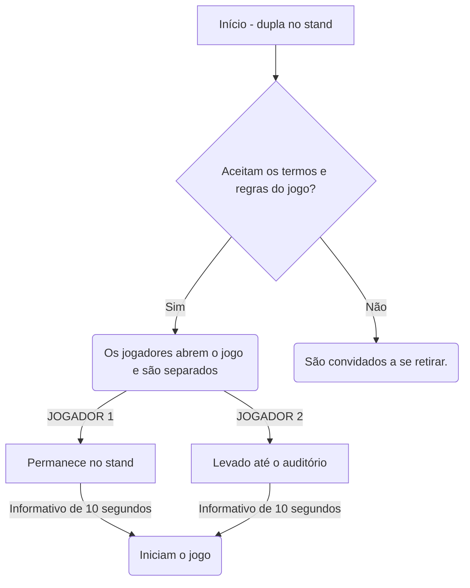
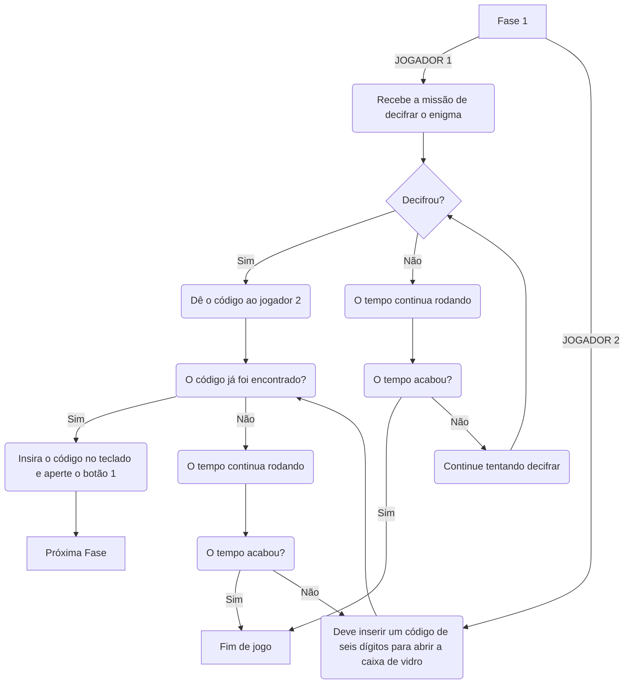
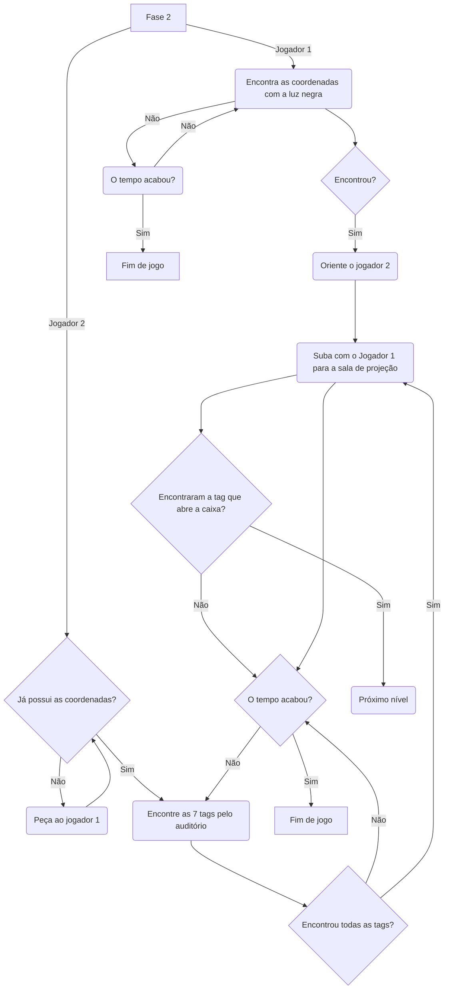
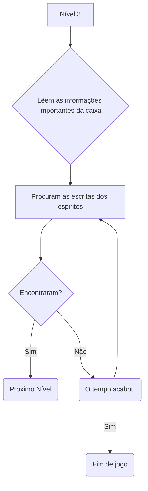
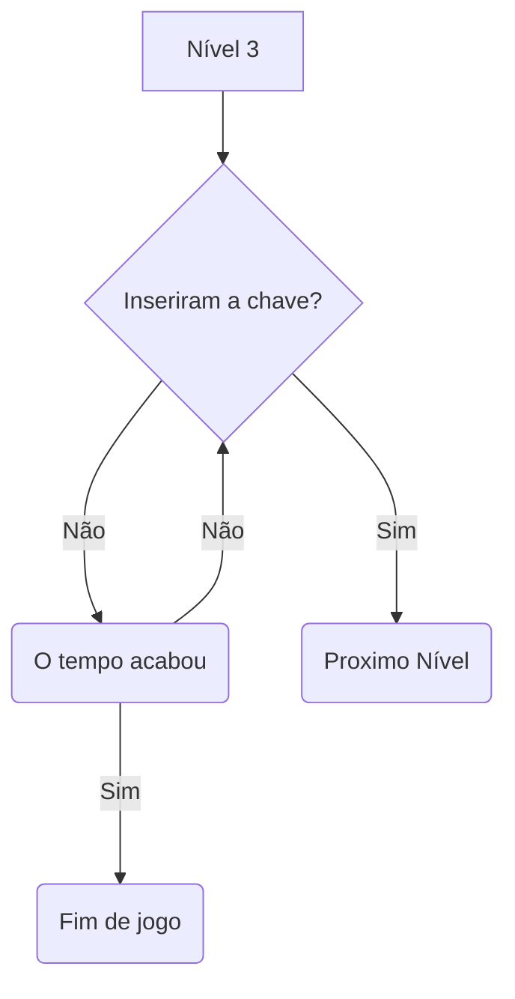
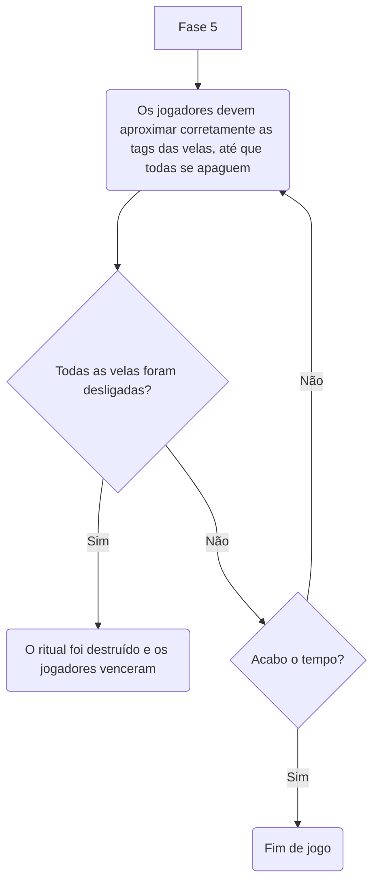
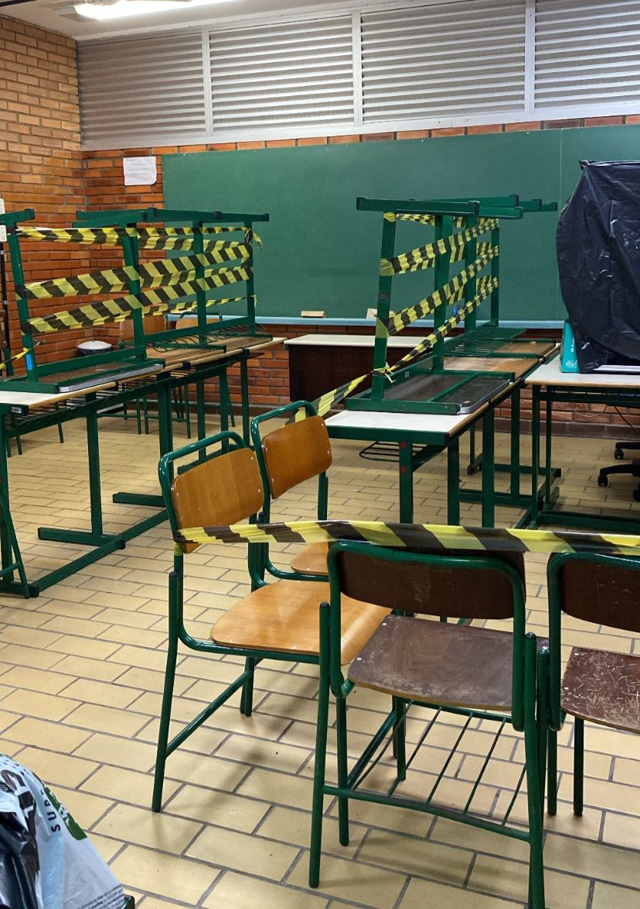
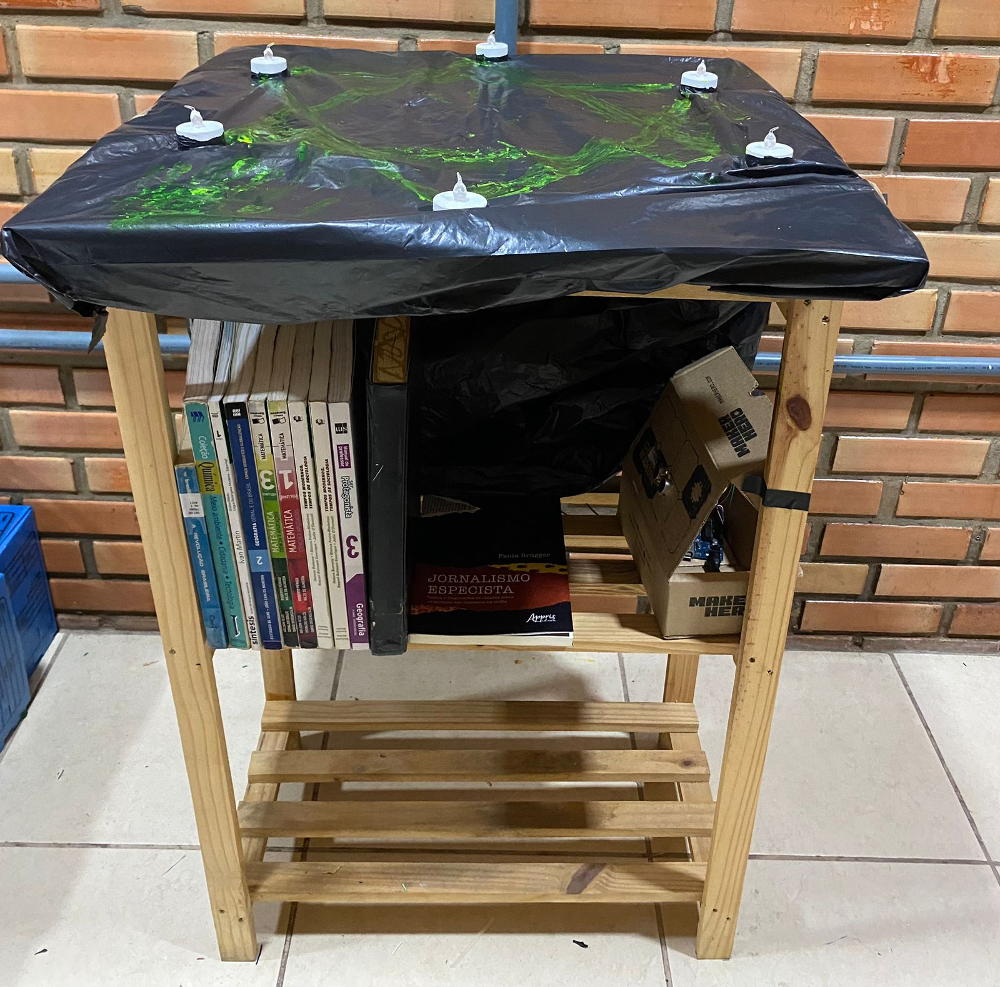
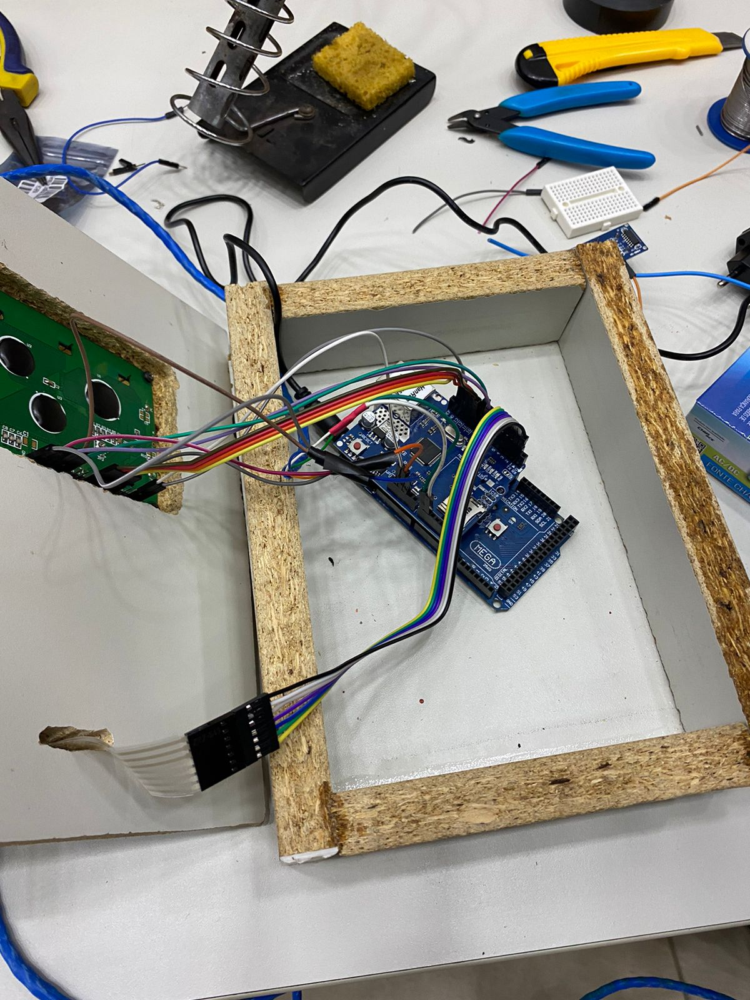
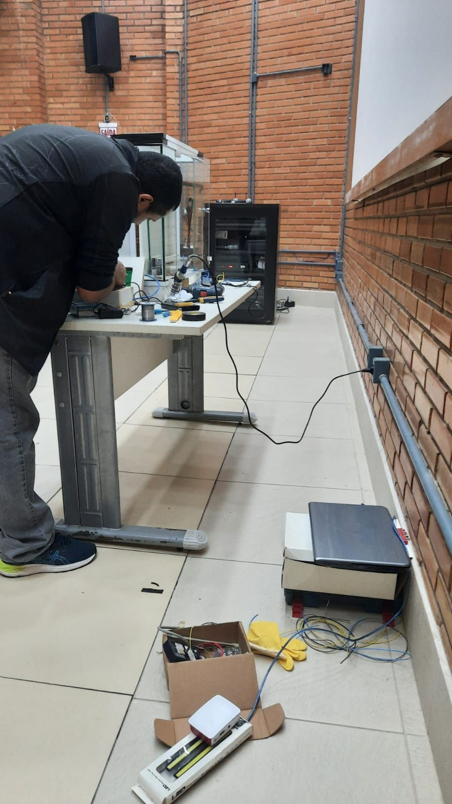

# O mistério da meia noite

### **PREMISSA:**
A cerca de 20 anos atrás, um órfão chegou na porta do câmpus pedindo abrigo, e caridosamente os docentes o abrigaram na sala de projeção acima do auditório em troca de que realizasse alguns trabalhos simples, como por exemplo auxiliar o zelador e trancar o campûs após a última pessoa ir embora pela noite.

Ao longo do tempo o garoto começou a relatar um desconforto em trabalhar ao lado do zelador, e dizer que tinha muito medo de ficar sozinho de noite no câmpus, mas por ser uma criança que passou por muitas situações traumáticas, as pessoas apenas ignoravam e diziam para ele ir dormir mais cedo e não inventar problemas.

Certo dia o garoto desapareceu, o zelador seria a única pessoa capaz de saber de algo pois eles passavam muito tempo juntos, mas disse que não fazia ideia do que tinha acontecido. 

A história ficou ainda mais estranha quando um professor contou que na noite anterior ao sumiço, estava passando aos arredores do campus perto da meia noite e escutou gritos horripilantes, TÃO tenebrosos que estimulou sua imaginação a pensar que alguém estivesse em apuros…Mas logo em seguida se convenceu que os sons eram apenas frutos da sua imaginação fértil, ignorou a situação e seguiu seu caminho.

Ao subirem para averiguar o quarto do menino, não haviam rastros de corpo algum, mas algumas velas suspeitas, uma caixa misteriosa ao lado da cama, e os pertences do órfão pelo local. A situação continua sem uma solução, porém alguns corajosos estão dispostos a ir em busca de respostas. Prontos para enfrentar este mistério?


### **JOGO IDEAL:**

**Início:**
As duas pessoas interessadas deverão ir até o stand, onde irão ler a premissa da história, assinar um termo de comprometimento e abrir a interface nos seus celulares através de um QR code.

O jogador 1 entra em uma parte fechada do stand e é orientado a por o fone de ouvido que estará a disposição, enquanto o jogador 2 é direcionado ao auditório. A interface ficará na tela de carregamento até que os dois jogadores estejam corretamente nos seus locais indicados.

Após esta etapa, a interface irá apresentar o seguinte informativo por 10 segundos: "Agora são 23:50 do dia 23 de junho. O ritual dos espíritos inicia à meia noite e vocês precisam terminar todos os níveis dentro do tempo indicado para conseguirem sair a salvo. Boa sorte…”. Após o informativo, se inicia o primeiro nível.

IMPORTANTE: os jogadores tem até 10 minutos para completar todas as fases do jogo, terá um cronômetro no canto superior da tela indicando o tempo.




**Nível 1:**

Jogador 1 (stand): aparece na tela que este jogador precisa encontrar um código, e para isso ele terá que usar a carta que vai estar em cima da mesa. Esta carta será um texto do garoto relatando alguns fatos.

Jogador 2 (auditório): é informado que precisa aguardar o código e inseri-lo corretamente para abrir a porta de vidro e pegar o molho de chaves.
Após conseguirem decifrar o código e o jogador 2 pegar as chaves, avançam para o próximo nível.



**Nível 2:**

Jogador 1(stand): aparece na sua tela que precisa encontrar as instruções desta fase no stand. Em cima da mesa, terá uma lanterna de luz negra e um mapa do auditório. As cadeiras serão sinalizadas com tinta fluorescente que só podem ser vistas com a luz negra. As coordenadas deverão ser informadas ao outro jogador. Quando o outro jogador seguir todas as coordenadas corretamente, este jogador deve juntar-se ao outro no auditório, para subirem na sala de projeção e conseguirem encontrar a tag que abre a caixa ao lado da cama.

Jogador 2(auditório):  este jogador precisa seguir as coordenadas e encontrar 7 tags pelo auditório, assim que ele localizar todas as tags o jogador 2 deve se juntar a ele no auditório para subirem até a sala de projeção. Chegando lá em cima terá uma caixa ao lado da cama que desbloqueia apenas com uma das tags, eles deverão encontrar qual é a correta para passar para o próximo nível. 



**Nível 3:**

Jogadores: encontram informações importantes sobre o zelador na caixa, com imagens, etc. Aparece na tela que nem tudo é o que parecem, mas os espiritos deixaram uma mensagem para as próximas pessoas que pisassem naquele local. Eles devem procurar pela sala onde os espiritos podem ter deixado algo escrito. Após encontrarem o livro com o fundo falso, o sensor vai idenficar e eles estarão no nível 4. 


**Nível 4:**

Jogadores: eles encontram uma chave no fundo falso do livro e são enganados pelos epiritos, que dizem que para finalizar o jogo só precisam inserir a chave no meio das velas.


**Nível 5:**

Jogadores: eles precisam usar as 6 tags restantes para desligar as velas do ritual e conseguirem sair antes da meia noite. As velas seguem uma ordem, assim que a tag da ordem errada é aproximada, todas se acendem novamente.
Caso consigam finalizar a tempo, chegam no final vitorioso do jogo. Devem voltar para o stand e comemorar a vitória juntos.



### **Hardware que será utilizado:**

Início: sensor de presença no auditório

Fase 1: Porta de vidro com motor, display e teclado integrado que faz a porta abrir caso a combinação (código) inserido esteja correto.

Fase 2: 7 tags. Tranca magnética para abrir a caixa que estará na sala de projeção.

Fase 3/4 : Sensor de movimento que indentifica que os jogadores encontraram o livro com fundo falso.

Fase 5: Sensor RFID que vai indentificar uma ordem correta de 6 tags, apagando uma por vez ou acendendo todas novamente quando algum erro é detectado.


### **OBJETIVO DO JOGO:**
Os jogadores tem o objetivo final de destruir o ritual antes da meia noite, para que não sejam capturados pelos espíritos e conseguirem salvar as almas que já estão presas local, mas até conseguir isso, terão que enfrentar uma sequência de níveis que exige raciocínio lógico e agilidade. Caso não consigam cumprir o tempo estimado para qualquer etapa, o jogo estará perdido e os jogadores devem se retirar. Informações que podem ser importantes para o jogo:
- Os jogadores devem estar atentos aos objetos ao seu redor, em um escape room qualquer objeto pode ser uma dica.

### **REGRAS:**
- Antes de começar, deverão assinar um termo de compromisso indicando que estão cientes que o jogo não é ligado a nenhum tipo de religião e trata-se de apenas um cenário falso.
- O jogo só pode ser jogado por duas pessoas ao mesmo tempo.
- Os jogadores vão se comunicar por áudio através da interface.
- As fases deverão ser executadas dentro do tempo indicado, na ordem indicada.
- Para desistir do jogo, deverá ser apertado um botão que ficará no canto da tela com o símbolo de perigo, e confirmar. Quando confirmarem a interface fecha e eles são liberados.
- Não podem sair do local que o jogo estará indicando durante a execução.
- O jogo deve ser terminado em no máximo 10 minutos. Terá um cronômetro no canto da tela sinalizando o tempo.
- Na lateral da interface terá um símbolo (triângulo amarelo de alerta) para que os jogadores desistam do jogo. Se este botão for acionado por qualquer um dos dois jogadores, uma sirene toca e o jogo se encerra.
- Os componentes eletrônicos presentes no escape room são sensíveis, é importante que os jogadores joguem com cuidado.
- Os jogadores devem tomar cuidado com as escadas do local.

### **REFERÊNCIAS:**
- [Filme Escape Room;](https://www.youtube.com/watch?v=v9JFZFQLt9k)
- [Filme Um classico filme de terror](https://www.youtube.com/watch?v=hYuV9N5egg8)
- [Série Stranger Things](https://www.netflix.com/br/title/80057281)
- [Jogo Pacify](https://store.steampowered.com/app/967050/Pacify/)
- [Filme Knives Out](https://www.youtube.com/watch?v=xi-1NchUqMA)

### **Sons do jogo**
- [Trilha sonora;](https://www.youtube.com/watch?v=CDWtH8eHeEU&t=648s)
- [Sons dos botões, final bom e final ruim.](https://mixkit.co/free-sound-effects/)


### **COMO GERAR RECEITA:**
- Venda de ingressos para entrada no Escape Room;
- Parceria com eventos/lugares para replicar o Escape Room em outros ambientes, aumentando o alcance.

### **MODELO DE NEGÓCIO: CANVAS:**

**Parceiros Chave**
```python
    - AWS (nuvem Amazon)
    - Arduino
    - Cineplay São José
    - MicroPython
    - Espressif
    - Continente Park Shopping
```

**Atividades Chave**
```python
    - Aprimoramento dos conhecimentos de JavaScript, HTML e CSS.
    - Estudo em desenvolvimento de jogos.
    - Aprimoramentos em estratégia de marketing.
    - Desenvolvimento manual do designer da interface em estilo de pixels.
    - Criação de redes sociais, posts de divulgação e mensagens para os potenciais usuários.
    - Estudo em tecnologia IoT e hardware.
    - Estudo de designer de interface virtual.
```

**Recurso Chave**
```python
    - Aplicação da lógica de programação.
    - Aplicação de hardware nos locais específicos do Escape Room.
    - Conta no GitPod para desenvolvimento do jogo online.
    - Diretório no GitHub para administração de tarefas.
    - Sites online de desenvolvimento de imagens em pixel.
 ```
    
**Proposta de Valor**
```python
    - Jogo desenvolve habilidades de cooperatividade, estratégia e raciocínio lógico.
    - Ao consumir o produto, o cliente apoia o trabalho de estudantes da rede federal
    - Desafia os jogadores a enfrentarem o próprio medo.
    - Experiência imersiva em local estilizado de acordo com o tema proposto.
```

**Relação com o cliente**
```python
    - E-mail do SAC - aparece no final do jogo e no folder físico - disponível (para elogios, relatos de bug, críticas, etc).
    - Divulgação por redes sociais.
    - Avaliação no stand ao final do jogo.
```

**Canais**
```python
    - Folders físico (distribuir pelo IFSC, para familiares e amigos).
    - Instagram
    - E-mail
```

**Segmentos de Mercado**
   ```python
    - Pessoas com acesso a Internet e a algum dispositivo móvel.
    - Gostam de enigmas, aventura e terror.
    - Pessoas que residem a grande Florianópolis.
    - A partir de 14 anos.
    - Dupla de colegas interessados no jogo.

   ```
**Estrutura de Custos**
```python
    - Salário de dois funcionários (designer e programador).
    - Uber corporativo
    - Assinatura de ferramentas online.
    - Cursos profissionalizantes.
    - Contador (controle da receita do CNPJ)
    - Compra de cenário e componentes eletrônicos.
    - Tráfego pago no Instagram.
    - Manutenção de componentes eletrônicos.
    - Pagamento de serviços de profissionais externos (ex: dublador de áudio).
```

**Fontes de Renda**
```python
    - Venda de ingressos.
    - Replicar o evento em outros locais, promovendo a empresa e criando parcerias.
```


###  **História Alternativa:**
 Devido a aceitação da história original no âmbito escolar, foi desenvolvida um novo contexto no estilo **horror cósmico** para o jogo ser apresentado ao público. As tecnologias em hardware e funcionalidades do jogo continuaram iguais, o que mudamos foi apenas a história, as artes da interface e o cenário.


**NOVA HISTÓRIA DESENVOLVIDA:**

*Carta para o primeiro jogador no stand (data é o código que deve ser informado para o jogador 2 inserir no teclado e abrir a porta de vidro):*


Na semana passada (16/06/23), John, o projetista do cinema do parque dos tijolinhos
estava em seu quarto, na sala de projeção onde morava, até que com que algo
misteriosamente cósmico aconteceu com ele.

--------------------------------------------------

*Carta encontrada pelos jogadores dentro da caixa com tranca magnética:*


John era um rapaz de 23 anos apaixonado por cinema. Não perdia um único
lançamento, o que não era muito difícil, já que era o próprio projecionista da cidade
onde morava. Seus filmes preferidos eram aqueles que envolviam histórias de horror
com bichos e entidades de outros mundos ou, melhor ainda, outras galáxias. Ele se
fascinava pelo horror cósmico de maneira que adorava esse tipo de assunto e
acumulava e colecionava elementos desse tipo em seu quarto.
Um dia, enquanto perambulava pelo parque de tijolinhos, John encontrou um pote com
uma espécie de geleia mucosa e neon, e sem dono aparente, abriu o pote e ao examinar
constatou que realmente era algo gosmento e brilhante. Sendo um cinéfilo de grande
porte, levou para seu quarto, afinal, achou aquilo muito instigante, como se fosse um
material de outro mundo.

Assim como em um dos muitos filmes que havia assistido, ficou entusiasmado para abrir e logo pôs em seu ritual cósmico para decorar.
No instante em que completou o hexagrama, um buraco ressurgiu do meio do ritual. Uma criatura terrível foi solta, desde então John não foi mais visto e o cinema parou de funcionar. Um líquido viscoso e brilhante está por todo o local, mas não se sabe ao certo o que aconteceu. 


------------------------------------------------------


*Carta encontrada pelos jogadores dentro do livro com fundo falso na fase 3/4:*


Cuidado, à meia noite a criatura cósmica retorna perto do ritual para alimentar-se de forças de seu mundo atravès do portal que é aberto, faça com que ele retorne ao seu próprio mundo, desative o ritual a tempo.


**IMAGENS DO CENÁRIO MONTADO**

- [Cenário sala de projeção;](https://www.youtube.com/shorts/kOlVcp6nJWw)
- [Cenário do auditório;](https://youtube.com/shorts/wuA8LyyEFC4?feature=share)
- [Sensor, teclado com display e porta de vidro com motor imbutido funcionando;](https://youtu.be/vzLIpyDTG_s)












### **Agradecimento Especial**

O projeto foi inicialmente idealizado por Isadora Alves Domingos e Sabrina Aparício, mas a sua realização e desenvolvimento pleno só foi possível pelo apoio que recebemos dos professores Ederson Torresini e Clayrton Monteiro Henrique. Estiveram ao nosso lado durante todo o processo, incentivaram, ajudaram no desenvolvimento e apoiaram o projeto.

